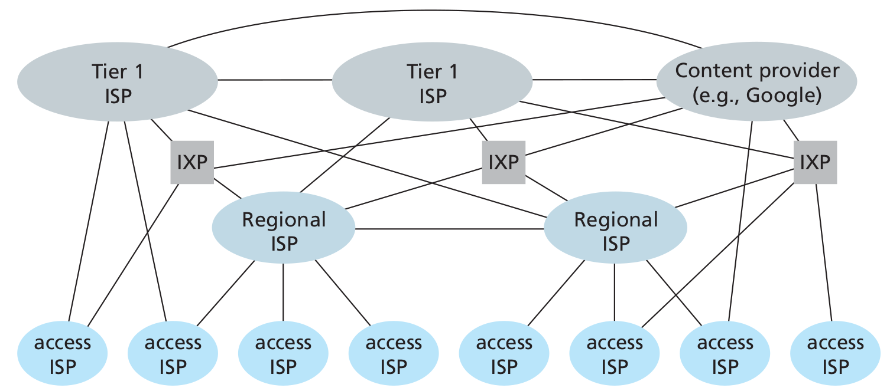
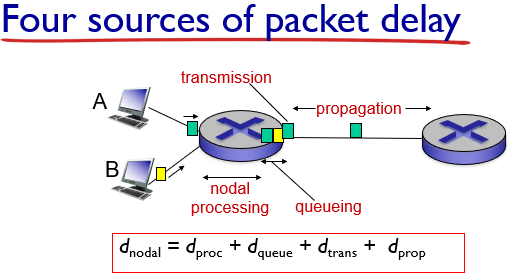
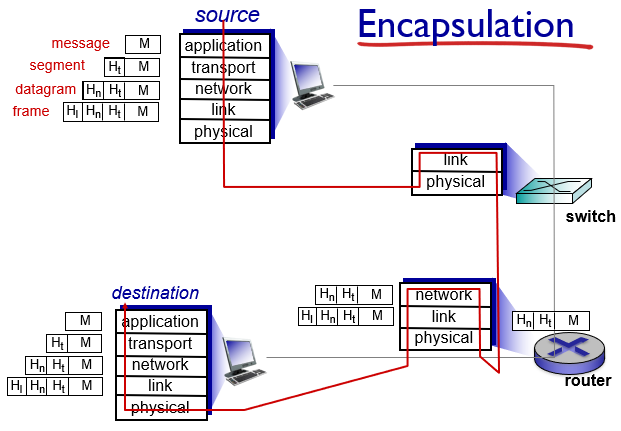

# Chapter 1: Computer Networks and the Internet

## 1.1 What is the Internet?

### 1.1.1 A nuts-and-bolts description

All the devices connected to the Internet are called **hosts** or **end systems**. End systems are connected together by a network of **communication links** and **packets switches**.

Different links can transmit data at different rates, with the **transmission rate** of a link measured in bits/second.

When one end system has data to send to another end system, the sending end system *segments* the data and adds *header bytes* to each segment. The resulting packages of information, called **packets**, are then sent through the network to the destination and system where they a reassembled into the original data.

A packet switch takes a packet arriving on one of its incoming communication links and forwards that packet on one of its outgoing communication links. The two most prominent types of packets switches are **routers** and **link switches**. The sequence of communication links and packet switches traversed by a packet from the sending end system to the receiving end system is known as **route** or **path**.

End systems access the Internet through **Internet Service Providers (ISPs)**, including residential ISPs (cable or phone company), corporate, university ISPs ...
Each ISP in itself is a network of packet switches and communication links.
*Lower tier* (which interconnect end-systems) ISPs are interconnected through national and international *upper tier* ISP. An upper-tier ISP consists of high speed routers interconnected with high-speed fiber-optic links. Each ISP network is managed independently.

End systems, packet switches and other pieces of the Internet run **protocols** that control the sending and receiving of information within the Internet.

### 1.1.2 A Services Description
The Internet can be described as *an infrastructure that provides services to applications*. These applications (Web, social networks, VoIP...) are said to be **distributed** since they involve multiple end systems that exchange data with each other.
**Internet applications run on end systems, not in the packet switches or routers**, packet switches facilitate the exchange of data, but they are not concerned with the application that is the source or sink of data.

End systems attached to the Internet provide and **Application Programming Interface (API)** that specifies how a program running on one end system asks the Internet infrastructure to deliver data to a specific destination program running on another end system.

### 1.1.3 What Is a Protocol?

**A protocol defines the format and the order of messages exchanged between two or more communicating entities, as weel as the actions taken on the trasmission and/or receipt of a message or other event**

## 1.2 The Network Edge
Computers and other devices connected to the Internet are often referred to as *end systems* as they sit at the edge of the Internet. They are also called *hosts* as they host, run, applications programs such as a Web Browser or an email client.

Hosts are sometimes further divided into two categories: *clients* and *servers*. The former being desktop, mobile pcs, smartphones, the latter being powerful machines that store and distribute Web pages, streams...
Nowadays most of the servers reside in large *data centers*

### 1.2.1 Access Networks
They are the networks that physically connect end systems to the first router on a path from the end system to any other distant end system.
Examples: mobile network, national or global ISP, local or regional ISP, home networks enterprise networks.

#### Home Access: DSL, Cable, FITH, Dial-Up and Satellite
Today, the two most prevalent types of broadband residential access are **digital subscriber line (DSL)** and **cable**.

A residence typically obtains DSL access from the telephone company (telco) that provides its wired local phone access. The customer's telco is therefore its ISP.
DSL modem use the existing telephone lines to exchange data with DSLAMs (digital subscriber line access multiplexer) located in the telco local central office. The DSL modem takes digital data and translates it to high-frequency tones for transmission over telephone wires, these analog signals from many houses are translated back into digital format at the DSLAM. The use of different frequencies allows the phone line to carry a high-speed downstream channel, a medium-speed upstream channel and an ordinary two-way telephone channel.
Hundreds or even thousands of households connect to a single DSLAM.

DSL: 24 Mbps downstream and 2.5 Mbps upstream (MAX VALUES). Because of the difference between these two values, the access is said to be **asymmetric**.

**Cable Internet** access makes use of the cable television company's existing cable television infrastructure. Cable modems connect to CMTS (Cablem Modem Termination System) which does the same job the DSLAM does for phone lines. The access is typically asymmetric.
CABLE: 42.8 Mbps downstream and 30.7 Mbps upstream (MAX VALUES).
Cable Internet access is a shared broadcast medium: each packet travels downstream on every link to every home and viceversa. For this, if several users are simultaneously using the downstream channel, the actual rate will be significantly lower.

Another up-and-coming technology that promises very high speeds is **fiber to the home (FTTH)**. The concept is simple: provide an optical fiber path from the Central Office (CO)

#### Access in the Enterprise and the Home: Ethernet and WiFi
On corporate and university campuses, and increasingly in home settings, a **Local Area Network (LAN)** is used to connect an end system to the edge router.
Ethernet is by far the most prevalent access technology is corporate, university and home networks. Ethernet uses twisted-pair copper wire to connect to an Ethernet switch which is connected into the larger Internet.
The Internet is increasingly accessed wirelessly: wireless users transmit/receive packets to/from an access point connected into the enterprise's network which in turn is connected to the wired Internet.

#### Wide-Area Wireless Access: 3G and LTE
Smartphones and Tablets employ the same wireless infrastructure used for cellular telephony to send/receive packets through a base station operated by the cellular network provider. Third generation (3G) wireless and fourth generation (4G) of wide-area network are being deployed. *LTE* ("Long-Term Evolution") has its root in 3G and can potentially achieve rates in excess of 10 Mbps.

### 1.2.2 Physical Media

A bit, when traveling from source to destination, passes through a series of transmitter-receiver pairs, for each pair, the bit is sent by propagating electromagnetic waves or optical pulses across a **physical medium**. This can take many shapes and forms and doesn't have to be of the same type for each transmitter-receiver pair along the path.
Physical media fall into two categories:

 - **guided media**: the waves are guided along a solid medium (fiber-optic cable, twisted-pair copper wire, coaxial cable)
 - **unguided media**: the waves propagate in the atmosphere and in outer space (wireless LAN, digital satellite channel)

## 1.3 The Network Core

### 1.3.1 Packet Switching
In a network application, end systems exchange **messages** with each other. To send a message from a source end system to a destination end system, the source breaks long messages into smaller chunks of data known as **packets**.
Between source and destination, each packet travels through communication links and **packet switches** (for which there are two predominant types, **routers** and **link-layer switches**).
Packets are transmitted over each communication link at a rate equal to the *full* transmission rate of the link. So, if a source end system or a packet switch is send a packet of L bits over a link with transmission rate R bits/sec, then the time to transmit the packet is L/R seconds.

#### Store-and-forward Transmission
Most packet switches use **store-and-forward transmission** at the inputs to the links. Store-and-forward transmission means that the packet switch must receive the entire packet before it can begin to transmit the first bit of the packet onto the outbound link. The link must **buffer** (*store*) the packet's bits and only after the router has received all of the packet's bits can it begin to transmit (*forward*) the packet onto the outbound link.

#### Queuing Delays and Packet Loss
Each packet switch has multiple links attached to it. For each attached link, the packet switch has an **output buffer** (or **output queue**) which stores packets that the router is about to send into that link.
If an arriving packet needs to be transmitted onto a link but finds the link busy with the transmission of another packet, the arriving packet must wait in the output buffer. Thus, packets suffer output buffer **queuing delays** which are variable and depend on the level of congestion in the network. Since the amount of buffer space is finite, an arriving packet may find the buffer completely full. In this case, **packet loss** will occur, either the arriving packet or one of the already queued packets will be dropped.

#### Forwarding tables and routing protocols
In the Internet, every end system has an address called an IP address. When a source end system wants to send a packet to a destination end system, the source includes the destination's IP address in the packet's header.
Each router has a **forwarding table** that maps destination addresses (or portions of the destination addresses) to that router's outbound links. When a packet arrives at the router, the router examines the address and searches its forwarding table, using this destination address, to find the appropriate outbound link.
A number of special **routing protocols** are used to automatically set the forwarding tables.

### 1.3.2 Circuit Switching
In circuit-switched networks, the resources needed along a path(buffers, link transmission rate) to provide for communication between the end systems are **reserved** for the duration of the communication sessions.
When two hosts want to communicate, the network establishes a **dedicated end-to-end connection** between them.

#### Multiplexing in Circuit-Switched Networks
A circuit in a link is implemented with either **frequency-division multiplexing (FDM)** or **time-division multiplexing (TDM)**.
With FDM, the frequency spectrum of a link is divided up among the connections established across the link. The width of the band is called the **bandwidth**.
For a TDM link, time is divided into frames of fixed duration, and each frame is divided into a fixed number of time slots.

#### Packet Switching Versus Circuit Switching
Packet switching is more flexible, uses resources efficiently and is simpler to implement (even if it requires congestion control).
Circuit switching offers performance guarantees but uses resources inefficiently

### 1.3.3 A Network of Networks
To create the Internet, ISPs must be interconnected, thus creating a *network of networks*.
Much of the evolution of the structure of the Internet is driven by economics and national policy, rather than by performance consideration.

Today's Internet is complex, consisting of a dozen or so tier-1 ISPs and hundreds of thousands of lower-tier ISPs. The ISPs are diverse in their coverage, with some spanning multiple continents and oceans, and others limited to narrow geographic regions. The lower-tier ISPs connect to the higher-tier ISPs and the higher-tier ISPs interconnect with one another. Users and content providers are customers of lower-tier ISPs and lower-tier ISPs are customers of higher-tier ISPs. Recently, major content providers (Google) have also created their own networks and connect directly into lower-tier ISPs where possible.

## 1.4 Delay, Loss and Throughput in Packet-Switched Networks

Computer networks necessarily constrain **throughput** (the amount of data per second that can be transferred) between end system, introduce delays between end systems and can actually lose packets.

### 1.4.1 Overview of Delay in Packet-Switched networks
As a packet travels from one node (host or router) to the subsequent host along his path, it suffers from several types of delays at *each* node along the path.

#### Types of Delay

##### Processing Delay
The **processing delay** consists of the time required to examine the packet's header and determine where to direct the packet. It may also include other factors, such as the time needed to check for bit-level errors occurred during transmission.
They typically are of the order of microseconds or less.
After processing the packet is sent to the queue preceding the link to the next router

##### Queuing Delay
At the queue, the packet experiences a **queuing delay** as it waits to be transmitted onto the link. It depends on the number of earlier-arriving packets, therefore if the queue is empty, then the packet's queuing delay will be 0.
Typically of the order of microseconds or milliseconds.

##### Transmission delays
If the length of the packet is `L` bits, and the **transmission rate** of the link is `R` bits/sec, then the **transmission delay** is `L/R`.
This is the amount of time required to push (transmit) all of the packet's bits into the link.
Typically on the order of microseconds to milliseconds.

##### Propagation Delay
The time required to propagate a bit from the beginning of the link to the next router is the **propagation delay**. The bit propagates at the propagation speed of the link, which depends on the physical medium of the link.
The propagation delay is the distance between two routers `d` divided by the propagation speed of the link. `s` *(~2x10^8 m/sec)*

##### Total nodal delay
it is the summation of the previous delays

### 1.4.2 Queuing Delay and Packet Loss
The queuing delay depends can vary from packet to packet, therefore when characterizing queuing delay, one typically uses statistical measures, such as *average queuing delay, variance of queuing delay, and the probability that the queuing delay exceeds some specified value*.

#### Packet Loss
A queue preceding a link has finite capacity. If a packet finds a full queue, then the router will **drop** it, the packet will be lost.
The fraction of lost packets increases as the traffic intensity increases.

### 1.4.3 End-to-End Delay
Let's now consider the **total delay, from source to destination** (not only the nodal delay). Let's suppose there are *N-1* routers between the source host and the destination host, then the nodal delays accumulate and give an **end-to-end delay**:

### 1.4.4 Throughput in Computer Networks
Another critical performance measure in computer networks is *end-to-end throughput*.
The **instantaneous throughput** at any instant of time is the rate (in bits/sec) at which host B is receiving a file.
If the file consists of `F` bits and the transfers takes `T` seconds to transfer the whole file, then the **average throughput** of the file is `F/T` bits/sec.
For a simple two-link network, the throughput is the min of all the throughputs, that is the transmission rate of the **bottleneck link**.
Therefore, the constraining factor for throughput in today's Internet is typically the *access network*.

## 1.5 Protocol Layers and Their Service Models

### 1.5.1 Layered Architecture
A layered architecture allows us to discuss a well-defined, specific part of a large and complex system. This simplification itself is of considerable value by providing *modularity*, making it much easier to change the implementation of the service provided by the layer: as long as the layer provides the same service to the layer above it, and uses the same services from the layer below it, the remainder of the system remains unchanged when a layer's implementation is changed.

#### Protocol Layering
To provide structure to the design of network protocols, the network designers organize protocols in **layers**. **Each protocol belongs to one of the layers**. We are interested in the **services** that a layer offers to the layer above, **service model** of a layer.
When taken together, the protocols of the various layers are called the **protocol stack**. The Internet protocol stack consists of five (seven - ISO/OSI reference model) layers:

 - Application
 - Presentation (ISO/OSI reference model)
 - Session (ISO/OSI reference model)
 - Transport
 - Network
 - Link
 - Physical

##### Application Layer
Where network applications and their applications-layer protocols reside.
The Internet's application layer includes many protocols: HTTP, SMTP, FTP, DNS.
An application-layer protocol is distributed over multiple end systems, with the application in one end system using the protocol to exchange packets of information with the application in another end system. This packet of information at the application layer is called **message**.

##### Presentation Layer
Allow applications to interpret meaning of data, e.g., encryption, compression, machine-specific conventions.

##### Session Layer
synchronization, checkpointing, recovery of data exchange.
Internet stack “missing” (presentation & session) layers! these services, if needed, must be implemented in application.

##### Transport Layer
It transports application-layer messages between application endpoints.
In the Internet there are two transport protocols: TCP and UDP.
TCP provides a **connection-oriented** service to its application: the service includes **guaranteed delivery** of application-layer messages to the destination and flow control unit. TCP also breaks long messages into shorter segments and provides a **congestion-control mechanism**, so that a source throttles its transmission rate when the network is congested.
HTTP and SMTP use *TCP*

UDP provides a connectionless service to its applications: it's a no-frills service that provides **no guarantees, no reliability, no flow control and no congestion control**.
A transport-layer packet is called **segment**
Skype uses UDP *(speed required)*

##### Network Layer
It is responsible for moving network-layer packets known as **datagrams** from one host to another.
The Internet's network layer includes the IP Protocol. There is only one IP Protocol and all the Internet components that have a network layer must run it.
The Internet's network layer also contains many **routing protocols** 
Often it is simply referred to as the IP protocols.

##### Link Layer
To move a packet from one node to the next, the network layer relies on the services of the link layer.
The services provided by the link layer depend on the specific link-layer protocol that is employed over the link.
Examples are *Ethernet, WiFi*.
We will refer to the link-layer packets as **frames**

##### Physical Layer
The job of the physical layer is to move the individual bits within the frame from one node to the next.
The protocols are link dependent and further depend of the actual transmission medium of the link.

### 1.5.2 Encapsulation

Routers and link-layer switches are both packet switches but routers and link-layer switches do not implement all of the layers in the protocol stack: link-layer switches implement Physical and Link while router add the Network Layer too.

From the Application Layer, the message passes to the transport layer, which appends additional information to it (the **Header**) that will be used by the receiver-side transport layer. The transport layer then adds its own header and passes the datagram to the link layer which adds it own link-layer header information.
Thus, we see that at each layer, a packet has two types of fields: **header fields** and a **payload field**, the payload typically being the packet from the layer above.

## 1.6 Networks Under Attack

### Malware
Along with all the good files we exchange on the Internet, come malicious software, collectively known as **malware** that can also enter and infect our devices.
Once a device infected, the malware can do all kinds of evil things: deleting files, install spyware...
A compromised host may also be enrolled in a network of thousands of similarly compromised devices, known as **botnet** which can be used for spam or distributed denial-of-service.
Much of the malware is **self-replicating**: it seeks entry into other hosts from the infected machines. Malware can spread in the from of a virus or a worm.

 - **Viruses** are malware that requires some form of user interaction to infect the user's device.
 - **Worms** are malware that can enter a device without any explicit user interaction.

### DoS
Denial-of-Service attacks render a network, host, or other piece of infrastructure unusable by legittimate users. Most of them fall into one of the three categories:

 - *Vulnerability Attack*: a few well-crafted messages are sent to a vulnerable application or operating system running on the targeted host. The service might stop or the host might crash.
 - *Bandwidth flooding*: a deluge of packets is sent to the targeted host, so many packets that the target's access link becomes clogged preventing legitimate packets from reaching the server
 - *Connection flooding*: a large number of half-open or fully open TCP connections are established at the targeted host, which can become so bogged down that it stops accepting legitimate connections.

In a **distributed DoS** (**DDoS**) attack the attacker controls multiple sources and has each source blast traffic at the target.

### Sniffing
A passive receiver can record a copy of every packet that passes through the network. It is then called a **packet sniffer**.
Because packet sniffers are *passive* (they do not inject packets into the channel), they are difficult to detect. Some of the best defenses against packet sniffing involve cryptography.

### Spoofing
The ability to inject packets into the Internet with a false source address is known as **IP Spoofing** and is but one of many ways in which one user can masquerade as another user.
To solve this problem we will need *end-point authentication*.

### The history of the Internet shaped is structure
The Internet was originally designed to be based on the model of a *group of mutually trusting users attached to a transparent network*, a model in which there is no need for security. Many aspects of the original Internet architecture deeply reflect this notion of mutual trust, such as the ability for one to send a packet to any other user is the default rather than a requested/granted capability.
However today's Internet certainly does not involve "mutually trusted users": communication among mutually trusted users is the exception rather the rule.
