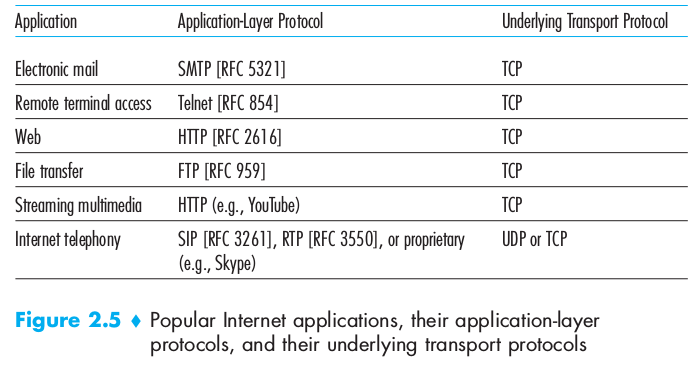
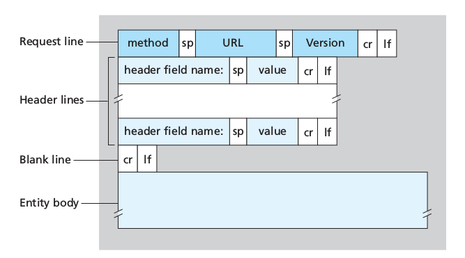
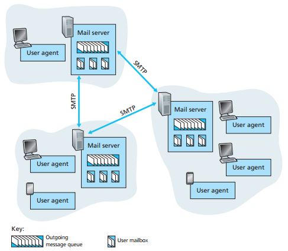
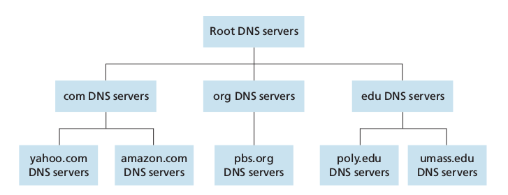
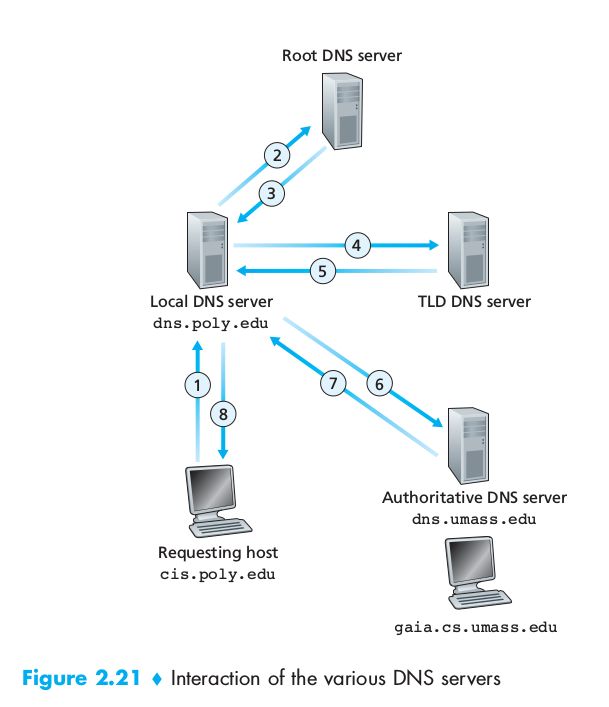

# Chapter 2: Application Layer

## 2.1 Principles of Network Applications
At the core of network application development is writing programs that run on different **end systems** and communicate with each over the network. The programs running on end systems might be different (server-client architecture) or identical (Peer-to-Peer architecture).
Importantly we write programs that run on end systems/hosts, not on network-core devices (routers/link-layer switches).

### 2.1.1 Network Application Architectures
From the application developer's perspective, the network architecture is fixed and provides a specific set of services to applications.
The **application architecture**, on the other hand, is chosen by him. In choosing the application architecture, a developer will likely draw one of the two predominant architectural paradigms used in modern network applications:

 - **Client-server architecture**: there is an always on host, called the *server* which serves requests from many other hosts, called *clients*: [Web Browser and Web Server]. Clients do not communicate directly with each other. The server has a fixed, well-known address, called an IP address that clients use to connect to him. Often, a single server host is incapable of keeping up with all the requests from clients, for this reason, a **data center**, housing a large number of hosts, is often used to create a powerful virtual server (via *proxyin*).
 - **P2P architecture**: there is minimal or no reliance on dedicated servers in data centers, the application exploits direct communication between pairs of intermittently connected bots, called *peers*. They are end systems owned and controlled by users. [Bittorrent, Skype]. P2P applications provide **self-scalability** (the network load is distributed) They are also **cost-effective** since they don't require significant infrastructure and server bandwidth. P2P face challenges:
	1. ISP Friendly (asymmetric nature of residential ISPs)
	2. Security
	3. Incentives (convincing users to participate)

Some applications have hybrid architectures, such as for many instant messaging applications: a server keeps track of the IP addresses of users, but user-to-user messages are sent directly between users.

### 2.1.2 Processes Communicating
In the jargon of operating systems, it's not programs but **processes** that communicate. A process can be thought of as a program that is running within an end system.
Processes on two different end systems communicate with each other by exchanging **messages** across the computer network: a sending process creates and sends messages into the network, a receiving process receives these messages and possibly responds by sending messages back.

#### Client and Server Processes
A network application consists of pairs of processes that send messages to each other over a network. For each pair of communicating processes we label:

 - the process that initiates the communication as the **client** [web browser]
 - the process that waits to be contacted to begin the session as the **server** [web server]

This labels stand even for P2P applications in the *context of a communication session*.

#### The Interface Between the Process and the Computer Network
A process sends messages into, and receives messages from, the network through a software interface called a **socket**.
**A socket is the interface between the application layer and the transport layer within a host**, it is also referred to as the **Application Programming Interface** (**API**) between the application and the network.
The application developer has control of everything on the application-layer of the socket but has little control of the transport-layer side of the socket. The only control that he has over the transport-layer is:

 1. The choice of the transport protocol
 2. Perhaps the ability to fix a few transport-layer parameters such as maximum buffer and maximum segment sizes

#### Addressing Processes
In order for a process running on one host to send packets to a process running on another host, the receiving process needs to have an address. To identify the receiving processes, two pieces of information need to be specified:

 1. The address of the host. In the Internet, the host is identified by its **IP Address**, a 32-bit (or 64) quantity that identifies the host uniquely.
 2. An identifier that specifies the receiving process in the destination host: the destination **port number**. Popular applications have been assigned specific port numbers (web server -> 80)

### 2.1.3 Transport Services Available to Applications
What are the services that a transport-layer protocol can offer to applications invoking it?

#### Reliable Data Transfer
For many applications, such as email, file transfer, web document transfers and financial applications, packet's drops and data loss can have devastating consequences. If a protocol provides guarantees that the data sent is delivered completely and correctly, it is said to provide **reliable data transfer**. The sending process can just pass its data into the socket and know with complete confidence that the data will arrive without errors at the receiving process.

#### Throughput
A transport-layer protocol could provide guaranteed available throughput at some specific rate. Applications that have throughput requirements are said to be **bandwidth-sensitive applications**.

#### Timing
A transport-layer protocol can also provide timing guarantees. Example: guarantees that every bit the sender pumps into the socket arrives at the receiver's socket no more than 100 msec later, interesting for real-time applications such as telephony, virtual environments...

#### Security
A transport-layer protocol can provide an application with one or more security services. It could encrypt all data transmitted by sending process and in the receiving host decrypt it.

### 2.1.4 Transport Services Provided by the Internet
The Internet makes two transport protocols available to applications: TCP and UDP.

#### TCP Services
TCP includes a connection-oriented service and a reliable data transfer service:

 - **Connection-oriented service**: client and server exchange transport-layer control information *before* the application-level messages begin to flow. This so-called *handshaking* procedure alerts the client and server, allowing them to prepare for an onslaught of packets. Then a **TCP connection** is said to exist between the sockets of the two processes. When the application finishes sending messages, it must tear down the connection

##### SECURING TCP
Nether TCP nor UDP provide encryption. Therefore the Internet community has developed an enhancement for TCP called **Secure Sockets Layer (SSL)**, which not only does everything that traditional TCP does but also provides critical process-to-process security services including *encryption*, *data integrity* and *end-point authentication*. It is not a third protocol, but an enhancement of TCP, **the enhancement being implemented in the application layer** in both the client and the server side of the application (highly optimized libraries exist). SSL has its own socket API, similar to the traditional one. Sending processes passes cleartext data to the SSL socket which encrypts it.

 - **Reliable data transfer service** The communicating processes can rely on TCP to deliver all data sent without error and in the proper order.

TCP also includes a **congestion-control mechanism**, a service for the general welfare of the Internet rather than for the direct benefit of the communicating processes. It throttles a sending process when the network is congested between sender and receiver.

#### UDP Services
UDP is a no-frills, lightweight transport protocol, providing minimal services. It is connectionless, there's no handshaking. The data transfer is unreliable: there are no guarantees that the message sent will ever reach the receiving process. Furthermore messages may arrive out of order. UDP does not provide a congestion-control mechanism neither.

#### Services Not Provided by Internet Transport Protocols
These two protocols do not provide timing or throughput guarantees, services not provided by today's Internet transport protocols. We therefore design applications to cope, to the greatest extent possible, with this lack of guarantees.



### 2.1.5 Application-Layer Protocols
An **application-layer protocol** defines how an application's processes, running on different end systems, pass messages to each other. It defines:

 - The type of the messages exchanged (request/response)
 - The syntax of the various message types
 - The semantics of the fields (meaning of the information in fields)
 - The rules for determining whem and how a process sends messages and responds to messages

## 2.2 The Web and HTTP
In the early 1990s, a major new application arrived on the scene: the World Wide Web (Berners-Lee 1994), the first application that caught the general public's eye.
The Web operates *on demand*: users receives what they want, when they want it.
It is enormously easy for an individual to make information available over the web, hyperlinks and search engines help us navigate through the ocean of web sites...

### 2.2.1 Overview of HTTP
The **HyperText Transfer Protocol (HTTP)**, the Web's application-layer protocol is a the heart of the Web. It is implemented in two programs: a client program and a server program.
The two programs talk to each other by exchanging HTTP messages.
A **Web page** (or document) consists of objects. An **object** is simply a file (HTML file, jpeg image...) that is *addressable by a single URL*.
Most Web pages consist of a **base HTML file** and several referenced objects. The HTML file references the other objects in the page with the objects' URLs.
Each URL has two components: the hostname of the server that houses the object and the object's path name.
**Web Browsers** implement the client side of HTTP.
**HTTP** uses TCP as its underlying transport protocol.
The server sends requested files to clients without storing any state information about the client: it is a **stateless protocol**

### 2.2.2 Non-Persistent and Persistent Connections
In many Internet applications, the client and server communicate for an extended period of time, depending on the application and on how the application is being used, the series of requests may be back-to-back, periodically at regular intervals or intermittently. When this is happening over TCP, the developer must take an important decision: should each request/response pair be sent over a *separate* TCP connection or should all of the requests and their corresponding responses be sent over the *same* TCP connection?
In the former approach, the application is said to use **non-persistent connections** and in the latter it is said to use **persistent connections**
By default HTTP uses non-persistent connections but can be configured to be use persistent connections.
To estimate the amount of time that elapses when a client requests the base HTML file until the entire file is received by the client we define the **round-trip time** (**RTT**) which is the time it takes for a small packet to travel from client to server and then back to the client.

#### HTTP with Non-Persistent Connections
For the page and each object it contains, a TCP connection must be opened (handshake request, handshake answer), we therefore observe an addition RTT, and for each object we will have a request followed by the reply
This model can be expensive on the server side: a new connection needs to be established for each requested object, for each connection a TCP buffer must be allocated along some memory to store TCP variables.

#### HTTP with Persistent Connections
The server leaves the TCP connection open after sending a response, subsequent requests and responses between the same client and server will be sent over the same connection. In particular an entire web page (text + objects) ca be sent over a single persistent TCP connection, multiple web pages residing on the same server can be sent from the server to the same client over a single persistent TCP connection.
**These requests can be make back-to-back** without waiting for replies to pending requests (**pipelining**).
When the server receives back-to-back requests, it sends the objects back-to-back.
If connection isn't used for a pre-decided amount of time, it will be closed.


### 2.2.3 HTTP Message Format
Two types of HTTP messages:

#### HTTP Request Message

```
GET /somedir/page.html HTTP/1.1
Host: www.someschool.edu
Connection: close
User-agent: Mozilla/5.0
Accept-language: fr
```

 - Ordinary ASCII text
 - First line: **request line**
 - Other lines: **header lines**
 - the first lines has 3 fields: method field, URL field, HTTP version field:
	- method field possible values: `GET, POST, HEAD, PUT, DELETE`

The majority of HTTP requests use the GET method, used to request an object.



 The entity body (empty with `GET`) is used by the `POST` method, for example for filling out forms. The user is still requesting a Web page but the specific contents of the page depend on what the user entered into the form fields. When `POST` is used, the entity body contains what the user entered into the form fields.
Requests can also be made with `GET` including the inputted data in the requested URL.
The `HEAD` method is similar to `GET`, when a server receives it, it responds with an HTTP message but it leaves out the requested object. It is often used for debugging.
`PUT` is often used in conjunction with web publishing tools, to allow users to upload an object to a specific path on the web servers.
Finally, `DELETE` allows a user or application to delete an object on a web server.

#### HTTP Response Message
A typical HTTP response message:

```
HTTP/1.1 200 OK
Connection: close
Date: ...
Server: ...
Last-Modified: ...
Content-Length: ...
Content-Type: text/html

(data data data data data ...)
```
 - Status line: protocol version, status code, corresponding status message
 - six header lines:
 	- the connection will be closed after sending the message
	- date and time when the response was created (when the server retrieves the object from the file system, insert object in the message, sends the response message)
	- Type of the server / software
	- Last modified: useful for object caching
	- Content-Length: number of bytes in the object
	- Content-Type
 - entity body: contains the requested object itself (data)

Some common status codes:

 `200 OK`: request succeeded, information returned
 `301 Moved Permanently`: the object has moved, the new location is specified in the header of the response
 `400 Bad Request`: generic error code, request not understood
 `404 Not Found`: The requested document doesn't exist on the server
 `505 HTTP Version Not Supported`: The requested HTTP protocol version is not supported by the server

### 2.2.4 User-Server Interaction: Cookies
An HTTP server is *stateless* in order to simplify server design and improves performances. A website can identify users using **cookies**.
Cookie technology has 4 components:

 1. Cookie header in HTTP response message
 2. Cookie header in HTTP request message
 3. Cookie file on the user's end-system managed by the browser
 4. Back-end database at the Website

User connects to website using cookies:

 - Server creates a unique identification number and creates an entry in its back-end database indexed by the identification number
 -server responds to user's browser including in the header: `Set-cookie: identification number`
 - The browser will append to the cookie file the hostname of the server and the identification number header
 - Each time the browser will request a page, it will consult the cookie file, extract the identification number for the site and put a cookie header line including the identification number

The server can track the user's activity: it knows exactly what pages, in which order and at what times that identification number has visited. This is also why cookies are controversial: a website can learn a lot about a user and sell this information to a third party.

Therefore **cookies can be used to create a user session layer on top of stateless HTTP**.

### 2.2.5 Web Caching
A **Web cache**, also called **proxy server** is a network entity that satisfies HTTP requests on behalf of an origin Web server. It has its own disk storage and keeps copies of recently requested objects in this storage.

 1. The browser establishes a TCP connection to the web cache, sending an HTTP request for the object to the Web cache.
 2. The web cache checks to see if it has a copy of the object stored locally. If yes, it will return it within an HTTP response message to the browser.
 3. If not, the Web cache opens a TCP connection to the origin server, which responds with the requested object.
 4. The Web caches receives the object, stores a copy in its storage and sends a copy, within an HTTP response message, to the browser over the existing TCP connection.

Therefore a **cache is both a server and a client at the same time**.
Usually caches are purchased and installed by ISPs.
They can substantially reduce the response time for a client request and substantially reduce traffic on an institution's access link to the Internet.

Through the use of **Content Distribution Networks (CDNs)** web caches are increasingly playing an important role in the Internet. A CDN installs many geographically distributed caches throughout the Internet, localizing much of the traffic.

#### The Conditional `GET`
Caches introduce a new problem: what if the copy of an object residing in the cache is stale?
The **conditional GET** is used to verify that an object is up to date.
An HTTP request message is a conditional get if

 1. the request message uses the `GET` method
 2. the request message includes an `If-modified-since:` header line.

A conditional get message is sent from the cache to server which responds only if the object has been modified.

## 2.3 Electronic Mail in the Internet
E-mail is an asynchronous communication medium—people send and read messages when it is convenient for them, without 
having to coordinate with other people’s schedules. it's fast, easy to distribute, and inexpensive. Modern e-mail has 
many powerful features, including messages with attachments, hyperlinks, HTML formatted text, and embedded photos.
Let’s take a high-level view of the Internet mail system and its key components.




We see from this diagram that it has three major components: **user agents, mail servers, and the 
Simple Mail Transfer Protocol (SMTP)**.
* Mail servers form the core of the e-mail infrastructure. Each recipient, has a mailbox located in one of the mail servers. 
user’s mailbox manages and maintains the messages that have been sent to him. A typical message starts its journey in the sender’s user agent(Microsoft Outlook ,Apple Mail ..), travels to the sender’s mail server, and travels to the 
recipient’s mail server, where it is deposited in the recipient’s mailbox. When recipient
wants to access the messages in his mailbox, the mail server containing his mailbox 
authenticates (with usernames and passwords). sender’s mail server must also 
deal with failures in recipient’s mail server. If sender’s server cannot deliver mail to recipient’s 
server, sender’s server holds the message in a **message queue** and attempts to transfer 
the message later. Reattempts are often done every 30 minutes or so; if there is no 
success after several days, the server removes the message and notifies the sender with an e-mail message.

* SMTP is the principal application-layer protocol for Internet electronic mail. It 
uses the reliable data transfer service of TCP to transfer mail from the sender’s mail 
server to the recipient’s mail server. As with most application-layer protocols, SMTP 
has two sides: a *client side*, which executes on the sender’s mail server, and a *server 
side*, which executes on the recipient’s mail server. Both the client and server sides of 
SMTP run on every mail server. When a mail server sends mail to other mail servers, 
it acts as an SMTP client. When a mail server receives mail from other mail servers, 
it acts as an SMTP server.


### 2.3.1 SMTP
SMTP is at the heart of Internet electronic mail. SMTP is much older than HTTP. Although SMTP has numerous 
wonderful qualities, as evidenced by its ubiquity in the Internet, it is nevertheless 
a legacy technology that possesses certain archaic characteristics. For example, it 
restricts the body (not just the headers) of all mail messages to simple 7-bit ASCII. 
But today, in the multimedia era, the 7-bit ASCII restriction is a bit of a pain—it requires 
binary multimedia data to be encoded to ASCII before being sent over SMTP; and it 
requires the corresponding ASCII message to be decoded back to binary after SMTP 
transport. Recall from Section 2.2 that HTTP does not require multimedia data to be 
ASCII encoded before transfer.
To illustrate the basic operation of SMTP, let’s walk through a common scenario. Suppose Alice wants to send Bob a simple ASCII message.
 1. Alice invokes her user agent for e-mail, provides Bob’s e-mail address (for 
example, bob@someschool.edu), composes a message, and instructs the 
user agent to send the message.
 2. Alice’s user agent sends the message to her mail server, where it is placed in a 
message queue.
 3. The client side of SMTP, running on Alice’s mail server, sees the message in the 
message queue. It opens a TCP connection to an SMTP server, running on Bob’s 
mail server.
 4. After some initial SMTP handshaking, the SMTP client sends Alice’s message 
into the TCP connection.
 5. At Bob’s mail server, the server side of SMTP receives the message. Bob’s mail 
server then places the message in Bob’s mailbox.
 6. Bob invokes his user agent to read the message at his convenience.
 
It is important to observe that SMTP does not normally use intermediate mail servers for sending mail, even when the two mail servers are located at opposite ends of 
the world. If Alice’s server is in Hong Kong and Bob’s server is in St. Louis, the TCP connection is a direct connection between the Hong Kong and St. Louis servers. 

Let’s now take a closer look at how SMTP transfers a message from a sending mail server to a receiving mail server. 
First, the *client SMTP* has TCP establish a connection to port *25* at the *server SMTP*. If the server is down, 
the client tries again later. Once this connection is established, the server and client perform some application-layer handshaking, SMTP clients and servers introduce themselves before transferring information. 
During this SMTP handshaking phase. Once the SMTP client and server 
have introduced themselves to each other, the client sends the message. SMTP can 
count on the reliable data transfer service of TCP to get the message to the server without errors. 
The client then repeats this process over the same TCP connection if it has 
other messages to send to the server; otherwise, it instructs TCP to close the connection.
Let’s next take a look at an example transcript of messages exchanged between an 
SMTP client (C) and an SMTP server (S). 

The hostname of the client is crepes.fr and the hostname of the server is hamburger.edu. The ASCII text lines prefaced 
with `C`: are exactly the lines the client sends into its TCP socket, and the ASCII text 
lines prefaced with `S`: are exactly the lines the server sends into its TCP socket. The 
following transcript begins as soon as the TCP connection is established

```
S:  220 hamburger.edu
C:  HELO crepes.fr
S:  250 Hello crepes.fr, pleased to meet you
C:  MAIL FROM: <alice@crepes.fr>
S:  250 alice@crepes.fr ... Sender ok
C:  RCPT TO: <bob@hamburger.edu>
S:  250 bob@hamburger.edu ... Recipient ok
C:  DATA
S:  354 Enter mail, end with ”.” on a line by itself
C:  Do you like ketchup?
C:  How about pickles?
C:  .
S:  250 Message accepted for delivery
C:  QUIT
S:  221 hamburger.edu closing connection
```

In the example above, the client sends a message (“Do you like ketchup? How about pickles?”) from mail server crepes.fr to mail server 
hamburger.edu. As part of the dialogue, the client issued five commands: 
HELO (an abbreviation for HELLO), MAIL FROM, RCPT TO, DATA, and QUIT. 
These commands are self-explanatory. The client also sends a line consisting of a single period, which indicates the end of the message to the server. The server issues replies to each command, 
with each reply having a reply code and some (optional) English-language explanation. We mention here that SMTP uses **persistent connections**: If the sending 
mail server has several messages to send to the same receiving mail server, it can send all of the messages over the same TCP connection. 
For each message, the client begins the process with a new MAIL FROM: crepes.fr, designates the 
end of message with an isolated period, and issues QUIT only after all messages have been sent.

### 2.3.2 Comparison with HTTP
Let’s now briefly compare SMTP with HTTP. Both protocols are used to transfer 
files from one host to another: HTTP transfers files (also called objects) from a Web 
server to a Web client (typically a browser); SMTP transfers files (that is, e-mail 
messages) from one mail server to another mail server. When transferring the files, 
both persistent HTTP and SMTP use persistent connections. Thus, the two protocols 
have common characteristics. However, there are *important differences*. **First**, HTTP 
is mainly a **pull protocol** someone loads information on a Web server and users 
use HTTP to pull the information from the server at their convenience. In particular, 
the TCP connection is initiated by the machine that wants to receive the file. On the 
other hand, SMTP is primarily a **push protocol** —the sending mail server pushes 
the file to the receiving mail server. In particular, the TCP connection is initiated by 
the machine that wants to send the file.
A **second difference**, which we alluded to earlier, is that SMTP requires each 
message, including the body of each message, to be in 7-bit ASCII format. If the 
message contains characters that are not 7-bit ASCII , then the message has to 
be encoded into 7-bit ASCII.
A **third** important difference concerns how a document consisting of text 
and images (along with possibly other media types) is handled. As we learned in 
Section 2.2, HTTP encapsulates each object in its own HTTP response message. 
SMTP places all of the message’s objects into one message.


### 2.3.3 Mail Message Formats
When an e-mail message is sent from one person to another, a header containing peripheral information precedes the 
body of the message itself. This peripheral information is contained in a series of header lines. The header lines and the body of the 
message are separated by a blank line (that is, by CRLF). 
A typical message header looks like this:
```
From: alice@crepes.fr
To: bob@hamburger.edu
Subject: Searching for the meaning of life.
```
After the message header, a blank line follows; then the message body (in ASCII) 
follows. 

### 2.3.4 Mail Access Protocols

Once SMTP delivers the message from sender’s mail server to recipient’s mail server, 
the message is placed in recipient’s mailbox. Throughout this discussion we have tacitly 
assumed that recipient reads his mail by logging onto the server host and then executing a 
mail reader that runs on that host. Up until the early 1990s this was the standard way 
of doing things. But today, mail access uses a client-server architecture—the typical 
user reads e-mail with a client that executes on the user’s end system, for example, 
on an office PC, a laptop, or a smartphone. By executing a mail client on a local PC, 
users enjoy a rich set of features, including the ability to view multimedia messages 
and attachments.

Given that the recipient executes his user agent on his local PC, it is natural 
to consider placing a mail server on his local PC as well. With this approach, sender’s 
mail server would dialogue directly with recipient’s PC. There is a problem with this 
approach, however. Recall that a mail server manages mailboxes and runs the client 
and server sides of SMTP. If recipient’s mail server were to reside on his local PC, then 
recipient’s PC would have to remain always on, and connected to the Internet, in order to 
receive new mail, which can arrive at any time. This is impractical for many Internet 
users. Instead, a typical user runs a user agent on the local PC but accesses its mailbox 
stored on an always-on shared mail server. This mail server is shared with other users 
and is typically maintained by the user’s ISP (for example, university or company).

Now let’s consider the path an e-mail message takes when it is sent from Alice 
to Bob. We just learned that at some point along the path the e-mail message needs 
to be deposited in Bob’s mail server. This could be done simply by having Alice’s 
user agent send the message directly to Bob’s mail server. And this could be done 
with SMTP—indeed, SMTP has been designed for pushing e-mail from one host to 
another. Why the two-step procedure? Primarily because without relaying through sender’s mail 
server, Alice’s user agent doesn’t have any recourse to an unreachable destination 
mail server. 

But there is still one missing piece to the puzzle! How does a recipient like Bob, 
running a user agent on his local PC, obtain his messages, which are sitting in a mail 
server within Bob’s ISP? Note that Bob’s user agent can’t use SMTP to obtain the 
messages because obtaining the messages is a pull operation, whereas SMTP is a 
push protocol. The puzzle is completed by introducing a special mail access protocol 
that transfers messages from Bob’s mail server to his local PC. There are currently a 
number of popular mail access protocols, including **Post Office Protocol—Version 
3 (POP3), Internet Mail Access Protocol (IMAP), and HTTP**.
SMTP is used to transfer mail from the sender’s mail server to the recipient’s mail 
server; SMTP is also used to transfer mail from the sender’s user agent to the sender’s mail server. 
A mail access protocol, such as POP3, is used to transfer mail from the recipient’s mail server to the recipient’s user agent.

#### POP3
POP3 is an extremely simple mail access protocol. Because the protocol is so simple, its functionality 
is rather limited. POP3 begins when the user agent (the client) opens a TCP connection to the mail server (the server) on port *110*. With the TCP connection established, 
POP3 progresses through three phases: **authorization, transaction, and update**. During the first phase, authorization, the user agent sends a username and a password 
(in the clear) to authenticate the user. During the second phase, transaction, the user 
agent retrieves messages; also during this phase, the user agent can mark messages 
for deletion, remove deletion marks, and obtain mail statistics. The third phase, 
update, occurs after the client has issued the *quit* command, ending the POP3 session; at this time, the mail server deletes the messages that were marked for deletion.

In a POP3 transaction, the user agent issues commands, and the server responds 
to each command with a reply. There are two possible responses: +OK , used by the server to indicate that the previous 
command was fine; and -ERR, used by the server to indicate that something was wrong with the previous command.
* Example:
```
+OK POP3 server ready
user bob
+OK
pass hungry
+OK user successfully logged on
```
If you misspell a command, the POP3 server will reply with an -ERR message.
Now let’s take a look at the transaction phase. A user agent using POP3 can 
often be configured (by the user) to “download and delete” or to “download and 
keep.” The sequence of commands issued by a POP3 user agent depends on which 
of these two modes the user agent is operating in. In the download-and-delete mode, 
the user agent will issue the list, retr, and dele commands. As an example, 
suppose the user has two messages in his or her mailbox. In the dialogue below, C:
(standing for client) is the user agent and S: (standing for server) is the mail server. 
The transaction will look something like:

```
C: list
S: 1 498
S: 2 912
S: .
C: retr 1
S: (blah blah ...
S: .................
S: ..........blah)
S: .
C: dele 1
C: retr 2
S: (blah blah ...
S: .................
S: ..........blah)
S: .
C: dele 2
C: quit
S: +OK POP3 server signing off
```

The user agent first asks the mail server to list the size of each of the stored messages. 
The user agent then retrieves and deletes each message from the server. Note that 
after the authorization phase, the user agent employed only four commands: list, 
retr, dele, and quit. After processing the quit command, the POP3 server enters the update phase and 
removes messages 1 and 2 from the mailbox.
A problem with this download-and-delete mode is that the recipient, Bob, may 
be nomadic and may want to access his mail messages from multiple machines, for 
example, his office PC, his home PC, and his portable computer. The download- anddelete mode partitions Bob’s mail messages over these three machines; in particular, 
if Bob first reads a message on his office PC, he will not be able to reread the message from his portable at home later in the evening. In the download-and-keep mode, 
the user agent leaves the messages on the mail server after downloading them. In this 
case, Bob can reread messages from different machines; he can access a message 
from work and access it again later in the week from home.
During a POP3 session between a user agent and the mail server, the POP3 
server maintains some state information; in particular, it keeps track of which user 
messages have been marked deleted. However, the POP3 server does not carry state 
information across POP3 sessions. This lack of state information across sessions 
greatly simplifies the implementation of a POP3 server.

#### IMAP
Like POP3, IMAP is a mail access protocol. It has many more features 
than POP3, but it is also significantly more complex.
An IMAP server will associate each message with a folder; when a message first 
arrives at the server, it is associated with the recipient’s *INBOX* folder. The recipient 
can then move the message into a new, user-created folder, read the message, delete 
the message, and so on. The IMAP protocol provides commands to allow users to 
create folders and move messages from one folder to another. IMAP also provides 
commands that allow users to search remote folders for messages matching specific 
criteria. Note that, unlike POP3, an IMAP server maintains user state information 
across IMAP sessions—for example, *the names of the folders and which messages 
are associated with which folders.*
**Another important** feature of IMAP is that it has commands that permit a user 
agent to obtain components of messages. This 
feature is useful when there is a low-bandwidth connection (for example, a slow-speed 
modem link) between the user agent and its mail server.

#### Web-Based E-Mail
With this service, the user agent is an *ordinary Web browser*, 
and the user communicates with its remote mailbox via HTTP. When a recipient, 
such as Bob, wants to access a message in his mailbox, the e-mail message is sent 
from Bob’s mail server to Bob’s browser using the HTTP protocol rather than the 
POP3 or IMAP protocol. When a sender, such as Alice, wants to send an e-mail 
message, the e-mail message is sent from her browser to her mail server over HTTP 
rather than over SMTP. Alice’s mail server, however, still sends messages to, and 
receives messages from, other mail servers using SMTP.


## 2.4 DNS - The Internet's Directory Service
One identifier for a host is its **hostname** [`cnn.com`, `www.yahoo.com`]. Hostnames are mnemonic and therefore used by humans. Hosts are also identified by **IP addresses**.

### 2.4.1 Services provided by DNS
Routers and use IP addresses. The Internet's **domain name system (DNS)** translates hostnames to IP addresses. The DNS is:

 1. A distributed database implemented in a hierarchy of **DNS Servers**
 2. An application-layer protocol that allows hosts to query the distributed database.

DNS servers are often UNIX machines running the **B**erkeley **I**nternet **N**ame **D**omaine (BIND) software.

**DNS runs over UDP and uses port 53**
It is often employed by other application-layer protocols (HTTP, FTP...) to translate user-supplied hostnames to IP addresses.

How it works:

 - The user machine runs the client side of the DNS application
 - The browser extracts `www. xxxxx . xxx` from the URL and passes the hostname to the client side of the DNS application
 - The DNS sends a query containing the hostname to a DNS server
 - The DNS client eventually receives a reply including the IP address for the hostname
 - The browser can initiate a TCP connection.

**DNS adds an additional delay**

DNS provides other services in addition to translating hostnames to IP addresses:

 - **host aliasing**: a host with a complicated hostname can have more alias names. The original one is said to be a **canonical hostname**.
 - **mail server aliasing**: to make email servers' hostnames more mnemonic. This also allows for an e-mail server and an Web server to have the same hostname.
 - **load distribution**: replicated servers can have the same hostname. In this case, a set of IP addresses is associated with one canonical hostname. When a client make a DNS query for a name mapped to a set of addresses, the server responds with the entire set, but rotates the ordering within each reply.

### 2.4.2 Overview of How DNS Works
From the perspective of the invoking application in the user's host, DNS is a black box providing a simple, straightforward translation service.
Having one single global DNS server would be simple, but it's not realistic because it would a **single point of failure**, it would have an impossible **traffic volume**, it would be **geographically too distant** from some querying clients, its **maintenance** would be impossible.


#### A Distributed, Hierarchical Database
The DNS uses a large number of servers, organized in a hierarchical fashion and distributed around the world.



The three classes of DNS servers:

 - **Root DNS servers**: In the Internet there are 13 root DNS servers, most hosted in North America, each of these is in reality a network of replicated servers, for both security and reliability purposes (total: 247)
 - **Top-level domain (TLD) servers**: responsible for top-level domains such as com org net edu and govand all of the country top-level domains uk fr jp
 - **Authoritative DNS servers**: every organization with publicly accessible hosts must provide publicly accessible DNS records that map the names of those hosts to IP addresses. An organization can choose to implement its own authoritative DNS server or to pay to have the records stored in an authoritative DNS of some service provider.

Finally there are **local DNS servers** which is central to the DNS architecture. They are hosted by ISPs. When a hosts connects to one of these, the local DNS server provides the host with the IP addresses of one or more of its local DNS servers. Requests can ho up to the root DNS servers and back down.



We can have both **recursive** and **iterative queries**.
In **recursive queries** the user sends the request its nearest DNS which will ask to a higher-tier server, which will ask to lower order... the chain goes on until it reaches a DNS that can reply, the reply will follow the inverse path that the request had.
In **iterative queries** the same machine sends requests and receives replies.
Any DNS can be iterative or recursive or both.

#### DNS Caching
DNS extensively exploits DNS caching in order to improve the delay performance and to reduce the number of DNS messages ricocheting around the Internet.
In a query chain, when a DNS receives a DNS reply it can cache the mapping in its local memory.

### 2.5.3 DNS Records and Messages
The DNS servers that implement the DNS distributed database store **resource records (RRs)** including RRs that provide hostname-to-IP address mappings.
Each DNS reply messages carries one or more resource records.

A resource record is a four-tuple that contains the fields: `(Name, Value, Type, TTL)`
`TTL` is the time to live of the resource record (when a resource should be removed from a cache). The meaning of `Name` and `Value` depend on `Type`:

| Type  	| Name               	| Value                                                                                                                                                               	|
|-------	|--------------------	|---------------------------------------------------------------------------------------------------------------------------------------------------------------------	|
| A     	| a hostname         	| IP address                                                                                                                                                          	|
| NS    	| a domain (foo.com) 	| hostname of an  authoritative DNS server which knows how to obtain the IP addresses for hosts in the domain. Used to route queries further along in the query chain 	|
| CNAME 	| a alias name       	| canonical hostname for the name in Name                                                                                                                             	|
| MX    	| alias hostname     	| canonical hostname of a mail server that has an alias hostname Name                                                                                                 	|
#### DNS Messages
The only types of DNS messages are DNS queries and reply messages. They have the same format:

 - first 12 bytes in the *header section*: 16-bit number identifying the query, which will be copied into the reply query so that the client can match received replies with sent queries. 1 bit query/reply flag (0 query, 1 reply). 1 bit flag authoritative flag set in reply messages when DNS server is an authoritative for a queried name. 1 bit recursion flag if the client desires that the server performs recursion when it doesn't have a record, 1 bit recursion-available field is set in the reply if the DNS server supports recursion
 - *question section*: information about the query: name field containing the name being queried, type field
 - *answer section*: resource records for the name originally queried: Type, Value, TTL. Multiple RRs can be returned if the server has multiple IP addresses
 - *authority section*: records for other authoritative servers.
 - *additional section*: other helpful records: canonical hostnames...

#### Inserting Records into the DNS Database
We created a new company. Next we register th domain name `newcompany.com` at a registrar. A **registrar is a commercial entity that verifies the uniqueness of the domain name, enters it into the DNS database and collects a small fee for these services**. When we register the address, **we need the provide the registrar with the IP address of our primary and secondary authoritative DNS servers**, that will make sure that a Type NS and a Type A records are entered into the TLD com servers for our two DNS servers.

##### Focus on security: DNS vulnerabilities

 - DDoS bandwidth-flooding attack
 - MITM: the mitm answers queries with false replies tricking the user into connecting to another server.
 - The DNS infrastructure can be used to launch a DDoS attack against a targeted host

To date, there hasn't been an attack that that has successfully impeded the DNS service, DNS has demonstrated itself to be surprisingly robust against attacks. However there have been successful reflector attacks, these can be addressed by appropriate configuration of DNS servers.

## 2.5 Peer-to-Peer Applications

### 2.5.1 File Distribution
In P2P file distribution, each peer can redistribute any portion of the file it has received to any peers, thereby assisting the server in the distribution process. As of 2012 the most popular P2P file distribution protocol is BitTorrent, developed by Bram Cohen.

#### Scalability of P2P architectures
Denote the upload rate of the server's access link by  , the upload rate of the *i*th peer's access link by  and the download rate of the *i*th access link by , the size of the to be distributed in bits ()
Comparison client-server and P2P.

#### Client-Server
The server must transmit one copy of the file to *N* peers, thus it transmits *NF *bits. The time to distribute the file is at least **NF/u_s**.
Denote 
 the link with the slowest download rate cannot obtain all *F* bits in less than  seconds
Therefore:

#### P2P
When a peer receives some file data, it can use its own upload capacity to redistribute the data to other peers.

 - At the beginning of the distribution only the server has the file. It must send all the bits at least once. 
 - The peer with the lowest download rate cannot obtain all *F* bits of the file in less than  seconds.
 - The total upload capacity of the system is equal to the summation of the upload rates of the server and of all the peers. The system must upload *F* bits to *N* peers, thus delivering a total of *NF* bits which can't be done faster that .

We obtain:


#### BitTorrent
In BitTorrent the collection of all peers participating in the distribution of a particular file is called a *torrent*. Peers in a torrent download equal-size *chunks* of the file from one another with a typical chunk size of 256 KBytes.
At the beginning a peer has no chunks, it accumulates more and more chunks over time. While it downloads chunks it also uploads chunks to other peers. Once a peer has acquired the entire file it may leave the torrent or remain in it and continue to upload chunks to other peers (becoming a *seeder*). Any peer can leave the torrent at any and later rejoin it.

Each torrent has infrastructure node called a *tracker*: when a peer joins a torrent, it registers itself with the tracker and periodically inform it that it is still in the torrent. The tracker keeps track of the peers participating in the torrent. A torrent can have up to thousands of peers participating at any instant of time.

User joins the torrent, the tracker randomly selects a subset of peers from the set of participating peers. User establishes concurrent TCP connections with all of these peers, called *neighboring peers*. The neighboring peers can change over time.
The user will ask each of his neighboring peers for the list of chunks they have (one list per neighbor).
The user starts downloading the chunks that have the fewest repeated copies among the neighbors (**rares first** technique). In this manner the rarest chunks get more quickly redistributed, roughly equalizing the numbers of copies of each chunk in the torrent.


Every 10 seconds the user measures the rate at which she receives bits and determines the four peers that are sending to her at the highest rate. It then reciprocates by sending chunks to these same four peers. The four peers are called **unchocked**. Every 30 seconds it also choses one additional neighbor at sends it chunks. These peers are called **optmistically unchocked**.

#### Distributed Hast Table (DHT). 
A distributed hash table is a simple database, with the database records being distributed over the peers in a P2P system. DHTs have 
been widely implemented (e.g., in BitTorrent) and have been the subject of extensive research.

### 2.6 Video Streaming and Content Distribution Networks

#### 2.6.1 Internet Video
In streaming stored video applications, the underlying medium is prerecorded video. These prerecorded videos are placed on servers, and users send requests to the servers to view 
the videos on demand.
* A *video* is a sequence of images, typically being displayed at a constant rate. it can be *compressed*, thereby trading off video quality 
with bit rate. Compressed Internet video typically ranges from 100 kbps for 
low-quality video to over 3 Mbps for streaming high-definition movies; 4K streaming envisions a bitrate of more than 10 Mbps. This can translate to huge amount of 
traffic and storage, particularly for high-end video. By far, the **most important** performance measure for streaming video is *average end-to-end throughput*. In order to provide continuous playout, the network must provide 
an average throughput to the streaming application that is at least *as large as* the bit 
rate of the compressed video.

#### 2.6.2 HTTP Streaming and DASH
In HTTP streaming, the video is simply stored at an HTTP server as an ordinary 
file with a specific URL. On the client side, the bytes are collected in a client application buffer. Once the number of bytes 
in this buffer exceeds a predetermined threshold, the client application begins playback—specifically, the streaming video application periodically grabs video frames 
from the client application buffer, decompresses the frames, and displays them on 
the user’s screen. Although HTTP streaming, has been 
extensively deployed in practice it has a **major shortcoming**: All clients receive the same encoding of the video. This has led Dynamic Adaptive Streaming 
over HTTP (DASH). In DASH, the video is encoded into several different versions (bit rates), DASH also allows a client to adapt to the available bandwidth 
if the available end-to-end bandwidth changes during the session. The HTTP server also has a manifest file, which provides a URL for each 
version along with its bit rate. 
1. The client first requests the manifest file and learns about the various versions. 
2. The client then selects one chunk at a time by specifying a URL and a byte range in an HTTP GET request message for each chunk. 

#### 2.6.3 Content Distribution Networks
For an Internet video company, perhaps the most straightforward approach to 
providing streaming video service is to build a single massive data center, store all 
of its videos in the data center, and stream the videos directly from the data center 
to clients worldwide. But there are **three major problems** with this approach. 
1. If the client is far from the data center, server-to-client packets will cross many communication links
2. A popular video will likely be sent many times over the same communication links.
3. If the data center or its links to the Internet goes down, it would not be able to distribute any video streams.

almost all major video-streaming companies make use of **Content Distribution Networks (CDNs)**. 
A CDN manages servers in multiple geographically distributed locations, stores copies of the videos (and other 
types of Web content, including documents, images, and audio) in its servers, and 
attempts to direct each user request to a CDN location that will provide the best user 
experience. The CDN may be a **private** CDN, or a **third-party CDN** that distributes content 
on behalf of multiple content providers

CDNs typically adopt one of two different server placement philosophies 
* Enter Deep. One philosophy, pioneered by Akamai, is to enter deep into the 
access networks of Internet Service Providers, by deploying server clusters in 
access ISPs all over the world. **The goal** is to get close to end users **but** the task of maintaining and managing the clusters becomes challenging.

* Bring Home. A second design philosophy, taken by Limelight and many other 
CDN companies, is to bring the ISPs home by building large clusters at a smaller 
number (for example, tens) of sites. Instead of getting inside the access ISPs, 
these CDNs typically place their clusters in Internet Exchange Points (IXPs), the bring-home 
design typically results in **lower maintenance and management overhead**, possibly at the expense of higher delay and lower throughput to end users.
Once its clusters are in place, the CDN replicates content across its clusters.

In fact, many CDNs do not push videos to their clusters but instead use a simple pull strategy: If a client requests 
a video from a cluster that is not storing the video, then the cluster retrieves the 
video (from a central repository or from another cluster) and stores a copy locally 
while streaming the video to the client at the same time. Similar Web caching (see 
Section 2.2.5), when a cluster’s storage becomes full, it removes videos that are not 
frequently requested.


##### CDN Operation
When a browser in a user’s host is instructed to retrieve a specific video (identified by a URL), the CDN must 
intercept the request so that it can 

1. determine a suitable CDN server cluster for that client at that time 
2. redirect the client’s request to a server in that cluster. 

Most CDNs take advantage of DNS to intercept and redirect requests Let’s consider a simple example to illustrate how the DNS is typically involved. 
Suppose a content provider, NetCinema, employs the third-party CDN company, KingCDN, to distribute its videos to its customers. On the NetCinema Web pages, each of its videos is assigned a 
URL that includes the string “video” and a unique identifier for the video itself; for 
example, Transformers 7 might be assigned http://video.netcinema.com/6Y7B23V. 
Six steps then occur.

1. The user visits the Web page at NetCinema.
2. When the user clicks on the link http://video.netcinema.com/6Y7B23V, the user’s host sends a DNS query for video.netcinema.com.
3. The user’s Local DNS Server (LDNS) authoritatives DNS server for NetCinema to “hand over” the DNS query to KingCDN
4. From this point on, the DNS query enters into KingCDN’s private DNS infrastructure. The user’s LDNS then sends a second query and KingCDN’s DNS system eventually returns the IP addresses of a video.
5. The LDNS forwards the IP address of the content-serving CDN node to the user’s host.
6. Once the client receives the IP address for a KingCDN content server, it establishes a direct TCP connection with the server at that IP address and issues an 
HTTP GET request for the video. 

##### Cluster Selection Strategies
A mechanism for dynamically directing clients to a server cluster or a data center within the CDN. 
* **One** simple strategy is to assign the client to the cluster that is geographically closest. Such a solution can work reasonably well for a large fraction of the clients. 
However, for some clients, the solution may perform poorly, since the geographically closest cluster may not be the closest cluster in terms of the length 
or number of hops of the network path. *Furthermore*, a problem inherent with all DNS based approaches is that some end-users are configured to use remotely located LDNSs,*Moreover*, this simple strategy ignores the variation in delay and available bandwidth over time of Internet paths, always assigning the same cluster to a particular client.

In order to determine the best cluster for a client based on the current traffic 
conditions, CDNs can instead perform **periodic real-time measurements** of *delay* 
and *loss performance* between their clusters and clients. For instance, a CDN can 
have each of its clusters periodically send probes (for example, ping messages or 
DNS queries) to all of the LDNSs around the world. One drawback of this approach 
is that many LDNSs are configured to not respond to such probes.

### 2.6.4 Case Studies: Netflix, YouTube, and Kankan
Skipping

## 2.7 Socket Programming: Creating Network Applications
Only code explication ----> skipping
