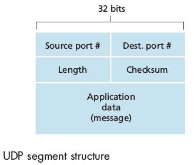
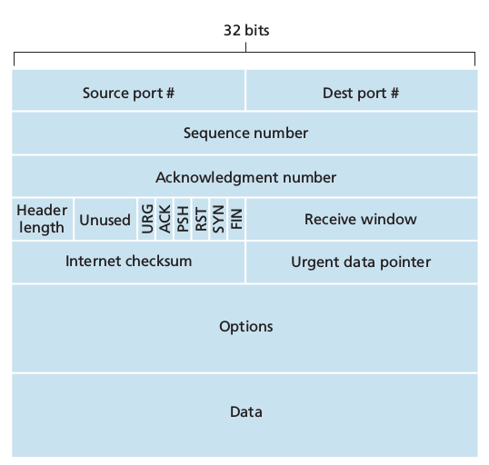
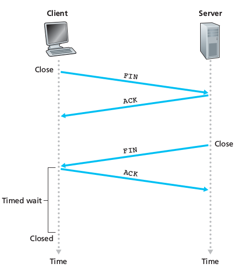

# Chapter 3: Transport Layer

## 3.1 Introduction and Transport-Layer Services

A transport-layer protocol provides for **logical communication** (as if the hosts running the processes were directly connected) between application processes running on different hosts. _Application_ processes use the logical communication provided by the transport layer to send messages to each other, *free* from the worry of the details of the physical infrastructure used.
**Transport-layer protocols are implemented in the end systems but not in network routers**.
On the sending side, the transport layer converts the application messages into transport-layer packets, known as transport-layer **segments**. This is done by

1. breaking them into **smaller chunks** 
2. adding a **transport-layer header** to each chunk. 
3. The transport-layer then passes the segment to the **network-layer** packet at the sending end-system.

On the receiving side

1. the network layer extracts the transport-layer segment from the **datagram**.
2. passes the segment up to the **transport-layer** which then processes the received segment.
3. making the data in the segment available to the received application.

### 3.1.1 Relationship Between Transport and Network Layers
Whereas a transport-layer protocol provides logical communication between *processes* running on different hosts, a network-layer protocol provides logical communication between *hosts*.

### 3.1.2 Overview of the Transport Layer in the Internet
A TCP/IP network (such as the Internet) makes two distinct transport-layer protocols available to the application layer:

 - **UDP** *User Datagram Protocol*, which provides an **unreliable, connectionless service** to the invoking application
 - **TCP** *Transmission Control Protocol* which provides a **reliable, connection-oriented service** to the invoking application.

The Internet network-layer protocol is the IP (Internet Protocol). The IP service model is a **best-effort delivery service**: it makes the best effort to deliver segments between hosts, *but it makes guarantees*:

 - it doesn't guarantee segment **delivery**
 - it doesn't guarantee **orderly** delivery of segments
 - it doesn't guarantee the **integrity** of the data in the segments

Thus IP is said to be an **unreliable service**.
Every host has **at least one network-layer address** a so-called IP address.

Extending host-to-host delivery to process-to-process delivery is called **transport-layer multiplexing and demultiplexing**.
UDP provides **process-to-process delivery and error checking** are the only services provided by UDP (therefore it is an unreliable service).
TCP provides **reliable data transfer** using *flow control, sequence numbers, acknowledgements and timers*. **TCP thus converts IP's unreliable service between end systems into a reliable data transport service between processes**
TCP also provides **congestion control**. it prevents any TCP connection from swamping the links and routers between communication hosts with an excessive amount of traffic giving each connection traversing a congested link an equal share of the bandwidth.

## 3.2 Multiplexing and Demultiplexing
**A multiplexing/demultiplexing service is needed for all computer networks**.

 - The job of delivering the data in a transport-layer segment to the correct socket is called **demultiplexing**.
 - The job of gathering data chunks at the source host from different sockets, encapsulating each data chunk with header information (which will be used in demultiplexing) to create segments and passing the segments to the networks layer is called **multiplexing**.

 Therefore sockets need to have **unique** identifiers and each segment needs to have **special fields** that indicate the socket to which the segment is delivered. These fields are the **source port number field** and the **destination port number field**. Each port number is a **16-bit number** ranging from 0 to 65535.
 Port numbers ranging from 0 to 1023 are called **well-known port numbers** and are **restricted, reserved** for us by well-known application protocols such as HTTP (80) and FTP (21). Designing an application, we should assign it a port number.

#### Connectionless Multiplexing and Demultiplexing
A UDP socket is fully identified by the **two-tuple**:
`(destination IP address , destination port number)`
therefore if two UDP segments have different source IP address and/or source port numbers but have the same destination IP address and destination port number, than the two segments will be directed to the same destination process via the same destination socket.

#### Connection-oriented Multiplexing and Demultiplexing
A TCP socket is identified by the **four-tuple**:
`(source IP address, source port number, destination IP address, destination port number)`
When a TCP segment arrives from the network to a host, the **host uses all four values to demultiplex the segment to the appropriate socket**.
Two arriving TCP segments with different source IP addresses or source port numbers will (with the exception of a TCP carrying the original connection establishment request) be directed to two different sockets.

Routine:

 - The TCP server application always has a **welcoming socket** that waits for connection establishment requests from TCP clients on port number X
 - The TCP client creates a socket and sends a connection **establishment request** (a TCP segment including destination port, source port number and *a special connection-establishment bit set in the TCP header*)
 - The server OS receives the incoming connection-request segment on port X, it locates the server process that is waiting to accept a connection on port number X, then creates **a new socket** which will be identified by
 `(source port number in the segment (cleint), IP address of source host (client), the destination port number in the segment (its own), its own IP address)`
 - With the TCP connection in place, client and server can now send data to each other

The server may support many simultaneous TCP connection sockets, with each socket attached to a process and each socket identified by its own four-tuple.

##### Port Scanning
Can be used both by attackers and system administrator to find weakness points in the target or to know network applications are running in the network.
The most used port scanner is **nmap** free and open source.
For TCP it scans port looking for port accepting connections, for UDP looking for UDP ports that respond to transmitted UDP segments.
It then returns a list of open, closed or unreachable ports.
A host running nmap can attempt to scan any target *anywhere* in the Internet

#### Web Servers and TCP
In a web server, all segments have destination port **80**, the server will distinguish clients using the source IP addresses and port numbers.
Moreover in today's high-performing Web, servers often use only one process and *create a new thread with a new connection soket for each new client connection*.

If using persistent HTTP, client and server will exchange messages via **the same server socket**. 
If using non-persistent HTTP, **a new TCP connection** is created and closed for every request/response and hence a new socket is created and closed for every request/response.

## 3.3 Connectionless Transport: UDP
If the developer chooses UDP, the application is almost directly talking with IP.
Note that with UDP there is **no handshaking** between sending and receiving transport-layer entities before sending a segment. For this reason UDP is said to be **connectionless**.
**DNS** is an example of an application layer protocol that typically uses UDP: there is no handshaking and when a client doesn't receive a reply either it tries sending the query to another name server or it informs the invoking application that it can't get a reply. 

Why should a developer choose UDP?

 - *Finer application-level controll over what data is sent and when*
 - *No connection establishement* 
 - *No connection state*
 - *Small packet header overhead* TCP has 20 bytes of header overhead in every segment versus the 8 of UDP

It is possible for an application developer to have reliable data transfer when using UDP. This can be done if reliability is built into the application itself.

### 3.3.1 UDP Segment Structure

The UDP header has only four fields, each consisting of two bytes: source and destination port number, checksum and length (which specifies the number of bytes in the UDP segment, header + data). This last field is needed since the size of the data field may differ from one UDP segment to the next. The checksum is used for error detection.

### 3.3.2 UDP Checksum
Provides for error detection, to determine whether the bits in the segment have been altered as it moves from source to destination.

At the send side, UDP performs the 1s complement of the sum of all the 16-bit (max 64) words in the segment, with any overflow encountered during the sum being wrapped around. This result is put in the checksum field of the UDP segment header.

UDP implements error detection according to the **end-end principle**: certain functionality (error detection in this case) must be implemented on an end-end basis: "functions placed at the lower levels may be redundant or of little value when compared to the cost of providing them at the higher level".

## 3.4 Principles of Reliable Data Transfer
It is the responsibility of a realiable data transfer protocol to implement reliable data service: 

1. no transferred data bits are corrupted 
2. no transferred data bits are lost and 
3. all transferred data bits are delivered in the order in which they were sent.

 - The sending side of the data transfer protocol will be invoked from above by a call to `rdt_send()`
 - On the receiving side `rdt_rcv()` will be called when a packet arrives while `deliver_data()` will be called when the `rdt` protocol wants to deliver data to the upper layer.

We will only consider the case of **unidirectional data transfer** that is data transfer from the sending to the receiving side. 

### 3.4.1 Building a Reliable Data Transfer Protocol

### 3.4.2 Pipelined Reliable Data Transfer Protocols
In today's high-speed networks stop-and-wait protocols are simply not tolerable: we  cannot send one packet and wait for the ACK and then send the second one, it is inefficient as we can see computing the **utilization of the channel**:

The solution is simple: rather than operate in a stop-and-wait manner, the sender is allowed to send multiple packets without waiting for acknowledgements. Since the many in-transit send-to-receiver packets can be visualized as filling a pipeline, this technique is known as **pipelining**.

Some consequences:

 - The range of sequence numbers must be increased: **each in-transit packet must have a unique sequence number**
 - Sender and receiver may have to buffer more than one packet.

Two basic approaches toward pipelined error recovery can be identified: **Go-Back-N** and **Selective Repeat**

### 3.4.3 Go-Back-N (GBN)
The sender is allowed to send `N` packets (**sender window size = N**), the receiver has a window of size **1**.
If a segment from sender to receiver is lost, the receiver discards all the segments with sequence number greater than the sequence number of the dropped packet, answering with ACK with this sequence number. (no packet re-ordering)
The sender will wait for ACK in order to move the window and send new packets. The wait is not infinite, after a certain time a timeout will occur and the sender will retransmit all the packets in the sending window.
In a Go-Back-N protocol, acknowledgements are **cumulative**: if sender receives ACK3 he will know that all the packets from 0 to 3 have been received, even if hasn't received ACK2.

### 3.4.4 Selective Repeat
When the window-size and bandwidth-delay product are both large, many packets can be in the pipeline and a single packet error can thus cause GBN to retransmit a large number of packets, many unnecessarily.
**Selective Repeat** avoid unnecessary retransmissions by having the sender retransmit only those that packets it suspects were received in error at the receiver:
**individual acknowledgements** (opposed to cumulative).
**sender window size = N** and **receiver window site = N**.
The sender has a timer for each packet in its window. When a timeout occurs, only the missing packet is resent.
The receiver buffers out of order packets.

## 3.5 Conncetion-Oriented Transport: TCP

### 3.5.1 The TCP Connection
TCP is said to be **connection-oriented** because before one application process can begin to send data to another, the two processes must first *handshake* with each other. During the connection establishment, both sides of the connection will initialize many TCP state variables.
TCP connection is not an end-to-end TDM or FDM circuit nor is it a virtual circuit as **the connection state resides entirely in the two end systems** and **not** in the intermediate network elements.

A TCP connection provides a **full-duplex service**: when a connection between process A and process B, application layer data can flow from A to B and, at the same time, from B to A.
TCP is also **point-to-point**: a connection is always  between a *single sender* and a *single receiver*, **no multicast possible**.

Establishment of the connection: the client first sends a special TCP segment, the server responds with a second special TCP segment and the client answer again with a third special TCP segment. The first two cannot contain a payload while the third can. Three segments: **three-way handshake**.
Both the sender and the receiver have buffers that are set up during the handshake.
The maximum amount of data that can be grabbed and placed in a segment is limited by the **maximum segment size (MSS)**.
TCP therefore splits data into smaller chunks and pairs each chunk of client data with a TCP header thereby forming **TCP segments** which are passed down to the network layer. When TCP receives a segment at the other end, the segment's data is placed in the TCP connection's receive buffer. **Each side of the connection has its own send buffer and its own receive buffer**

### 3.5.2 TCP Segment Structure

 - 32 bit sequence number and acknowledgement number necessary for reliable data transmission
 - 16 bit **receive window** used for flow control, indicates the number of bytes that a receiver is willing to accept
 - 4 bit **header length field**. The TCP header can be of a variable length due to the TCP options field (usually empty therefore usual length is 20 bytes)
 - **options field** used to negotiate MSS or as a window scaling factor for use in high speed networks.
 - **flag field**:
* **ACK** used to indicate that the segment contains an acknowledgement for a segment that has been successfully received.
*  
* **RST, SYN, FIN** for connection setup and teardown
* **PSH** indicates that the receiver should pass the data to upper layer immediately
* **URG** indicates that there is data in the segment that the sending side upper layer has marked as urgent.

#### Sequence Numbers and Acknowledgment Numbers
TCP views data as *an unstructured, but ordered, stream of bytes* and TCP's use of sequence numbers reflects this view: sequence numbers are over the stream of bytes and not over the series of transmitted segments.
The **sequence number for a segment** is the byte-stream number of the first byte in the segment.
EX 500,000 bytes, MSS = 1,000 bytes => 500 segments are created. First is numbered 0, second 1000, third 2000.....

**The acknowledgement number** *that Host A puts in its segment is the sequence number of the next byte Host A is expecting from Host B*.
TCP is said to provide **cumulative acknowledgements**: if sender receives ACK 536 he will know that all the bytes from 0 to 535 have been well received.
Usually both sides of a TCP connection randomly choose an initial sequence number **randomly** both for security and for minimizing the possibility that a segment that is still present in the network.

### 3.5.3 Round-Trip Time Estimation and Timeout

TCP uses a timeout/retransmit mechanism to recover from lost segments. The question rises: How long should the timeout intervals be?
Clearly the timeout should be larger than the connection's round-trip time? How much larger? How can the RTT be evaluated?

#### Estimating the Round-Trip Time
The sample RTT, `SampleRTT`, for a segment is the amount of time between when the segment is sent (passed to network layer) and when an acknowledgement for the segment is received.
Most TCP implementations take one `SampleRTT` at a time: at any point in time, the `SampleRTT` is being estimated for only one of the transmitted but currently unacknowledged segments, leading to a *new value of `SampleRTT` for approximatively every RTT*.
TCP **never computes a `SampleRTT` for a segment that has been retransmitted**, only for segments transmitted once.
In order to estimate a typical RTT, TCP keeps an average called `EstimatedRTT` of the `SampleRTT` values. Upon obtaining a new `SampleRTT` TCP updates this estimation according to the formula:

 where usually `a = 1/8 = 0.125`

We note that this weighted average puts more weight on recent samples than on old samples. In statistics such an average is called an **exponential weighted moving average (EWMA)**.

It is also useful to having an estimate of the *variability of the RTT*. We can measure how much `SampleRTT` typically deviates from `EstimatedRTT`:

We note that this is an `EWMA` of the difference of estimated and last measured RTT. The recommended value for b is `b = 0.25`

#### Setting and Managing the Retransmission Timeout Interval

An initial `TimeoutInterval` value of `1` second is recommended.
Also **when a timeout occurs, the value of `TimeoutInterval` is doubled** in order to avoid a premature timeout occurring for a subsequent segment that will soon be acknowledged. As soon as a segment is received and `EstimatedRTT` is updated, the `TimeoutInterval` is again computed using the formula above.

### 3.5.4 Reliable Data Transfer
TCP creates a **reliable data transfer service** on top of IP's unreliable best-effort service. It ensures that the data stream that a process reads out of its TCP receive buffer is *uncorrupted, without gaps, without duplication and in sequence*.
We supposed until now that an individual timer was associated with each transmitted segment. However timer management can require considerable overhead. Thus the recommended TCP timer management procedures (defined by RFC standards) use only a ***single*** retransmission timer (it is helpful to think of the timer as being *associated with the oldest unacknowledged segment*).

 1. Upon receiving data from the application layer, TCP encapsulates it in a segment and passes to the segment to IP. If the timer is not running for some other segment, TCP starts it when the segment is passed to IP, the timer expiration interval being `TimeoutInterval`
 2. If the timeout occurs, TCP responds by **retransmitting the segment that caused the timeout** and by restarting the timer
 3. An valid acknowledgement segment is received: TCP compares the ACK `y` value with its `sendBase` (the sequence number of the oldest unacknowledged byte). If `y > sendBase` then ACK is acknowledging one or more previously unacknowledged segments (cumulative acknowledgement). The `sendBase` variable is updated and the timer is restarted if there are not-yet-acknowledged segments.

 

#### Doubling the Timeout Interval

Each time TCP retransmits, it sets the next timeout interval to twice the prevous value. However when the timer is restarted after receiving data from the application layer or after receiving an ACK, the `TimeoutInterval` is recomputed as described previously

#### Fast Retransmit
The problem with timeout-triggered retransmission is that the timeout period can be relatively long.
The sender can however often detect packet loss before the timeout event occurs by noting *duplicate ACKs*. A **duplicate ACK** is an ACK that reacknowledges a segment for which the sender has already received an earlier acknowledgement.
When the TCP sender receives **three duplicate ACK for the same data** it takes this as an indication that the segment following the segment that has been ACKed three times has been lost. In the case that three duplicate ACKs are received, the TCP sender performs a **fast restransmit**: it retransmits the missing segment *before* that segment's timer expires.

#### Go-Back-N or Selective Repeat?
Acknowledgments are cumulative (GBN) but many TCP implementations will buffer correctly received but out-of-order segments.
Also consider fast retransmit where only the missing packet is resent (SR) instead of all the window (GBN).
We can see that TCP's error recovery mechanism is categorized as a **hybdrid of GB and SR protocols**.

### 3.5.5 Flow Control
The host on each side of a TCP connection set aside a receive buffer for the connection. When TCP receives bytes that are correct and in sequence, it places the data in the receive buffer. The associated application process will read data from this buffer, but necessarily at the instant the data arrives (busy, not interested...). Thus the *the sender can easily overflow the connection's receive bufffer by sending too much data too quickly*. To avoid this event, TCP provides a **flow-control service**.
Flow control is a *speed-matching service*: matching the rate at which the sender is sending against the rate at which the receiving application is reading.

**Flow control and congestion control are not the same!**: the former preventing overflow at the receiver side and being actuated only by the two end points, the latter preventing congestion of the network.

TCP provides flow control by having the *sender* maintain a variable called the **receive window**, used to give the sender an idea of how much free buffer space is available at the receiver.

Host A sends a large file to Host B over TCP.

##### B side

	1. B allocates a receive buffer to its connection, its size being `RcvBuffer`
	2. B also keeps the variables: `LastByteRead` (number of last byte in the data stream read by the application process) and `LastByteRcvd` (the number of the last byte arrived from the network and placed in the receive buffer)

We have: `LastByteRcvd - LastByteRead <= RcvBuffer` (we don't want overflow!)

Receive window aka the *amount of spare room in the buffer* `rwnd = RcvBuffer -  [LastByteRcvd - LastByteRead]`
`rwnd` is dynamic

##### A side
A keeps track of two variables:

	1. `LastByteSent`
	2. `LastByteAcked`

Through the connection's life A must make sure that `LastByteSent - LastByteSent <= rwnd`

If B's buffer becomes full, he sends `rwnd = 0`.  If *B has nothing to send to A*, when the application process empties B's buffer, TCP does not send a new segment with the new value of `rwnd` to A (TCP sends to A only if it needs to send data or if it needs to send an ACK).
Therefore A is never informed that B's buffer has some free space and **he is blocked and can trasmit no more data**.
To solve this problem, TCP requires A to **continue to send segments with one data byte when B's receive window is 0**, these segments will be acknowledged by B. Eventually the buffer will begin to empty and the acknowledgements will contain à non-zero `rwnd` value.

We remember that **UDP has no flow control service**

### 3.5.6 TCP Connection Management
#### How is the connection established? **Three-way handshake**

 1. The client-side TCP sends a special TCP segment to server-side TCP. This segment **doesn't contain any application-layer data** but the **flag bit SYN is set to 1**. The segment is referred to as a *SYN segment*. The client also **randomly chooses an initial sequence number** (`client_isn`) and **puts this number in the sequence number field of the initial TCP SYN segment**. (randomizing `client_isn` is interesting to avoid security attacks).
 2. The TCP SYN segment arrives at the server-side, it is extracted from the datagram. The server allocates the TCP buffers and variables to the connection and **sends a connection-granted segment to the client**. This segment also contains no application-layer data. The **SYN flag is set to 1**, the **ACK field in the header is set to `client_isn+1`**. **The server chooses its own initial sequence number `server_isn`** and **puts this value in the sequence number field of the TCP segment header**. This segment is referred to as *SYNACK segment*.
 3. Upon receiving the SYNACK segment, the client also allocates buffers and variables to the connection. The client then **sends the server yet another segment which acknowledges the SYNACK** (`server_isn+1` is set the acknowledgement field of the TCP segment header)

After this setup, all the segments will have the SYN bit set to 0 in their headers.

#### Tearing down a TCP connection

The client decides to end the connection:

 1. The client sends a special TCP segment to the server, this special segment having the **FIN bit flag set to 1** in the header.
 2. The server receives the segment and sends an acknowledgement to the client.
 3. The server then sends its own shutdown segment which also **has the FIN bit set to 1**
 4. The client acknowledges the server's shutdown segment.
 5. The "resources" (buffers and variables) in the host**s** are deallocated.

#### What if the two ends are not ready for communication?
A host receives a TCP segment whose port number or source IP address do not match with any of the ongoing sockets in the host -> the host sends a special reset segment to the source (RST flag bit set to 1) and drops the packet (UDP does responds with a special ICMP datagram)
